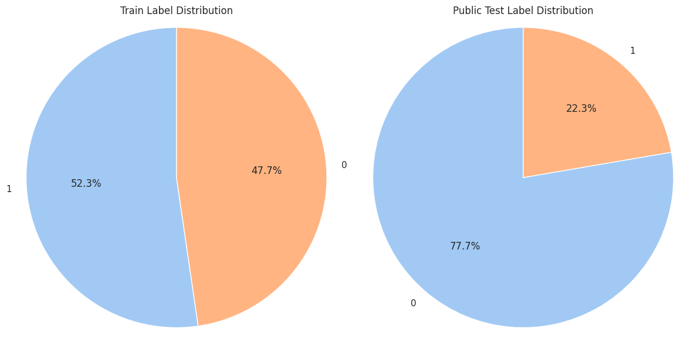
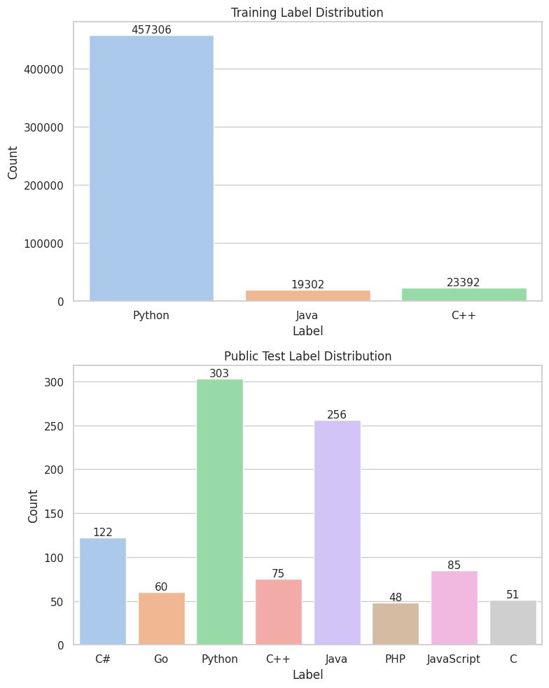
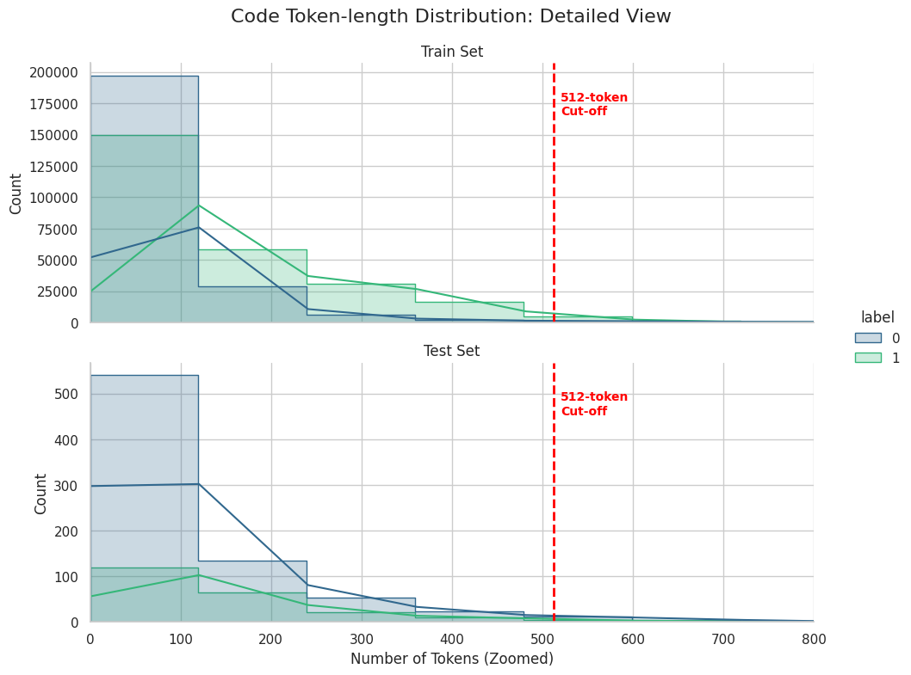

# SemEval 2026 Task 13 Subtask A — Approach Report

## 1. Task Overview

**Task**: SemEval 2026 Task 13, Subtask A — Binary classification of code snippets as Human-written (0) or AI-generated (1).

| Split | Size |
|---|---:|
| Train | 500,000 |
| Validation | 100,000 |
| Public test | 1,000 |
| Hidden test | 500,000 |

- **Label**: 0 = Human-written, 1 = AI-generated
- **Evaluation metric**: Macro F1

  
   
  <b>Fig 1:</b> Label Distribution (Human vs. AI-generated): The training and validation sets maintain a balanced class distribution, whereas the test set is intentionally imbalanced to reflect real-world scenarios.

  
   
  <b>Fig 2:</b> Distribution of Programming Languages: Python, Java, and C++ comprise the majority of the training data, while the inclusion of diverse minority languages enables out-of-distribution testing.

  
   
  <b>Fig 3:</b> Token-Length Distribution (Human vs. AI): Distribution of code lengths in the training set, with a dashed line marking the 512-token truncation limit. While AI-generated code tends to be longer on average, most snippets across both classes fall within the model's 512-token context window.

Have a look at [eda.ipynb](eda.ipynb)

---

## 2. Approaches

### Approach 1 — Hand-Crafted Stylometry Features

**Source**: [Stylometry_ML.py](src/Stylometry_ML.py)

**Description**: Extract interpretable statistical and structural features from raw code text without any neural model. The intuition is that human and AI code differ systematically in formatting habits, naming conventions, and structural patterns.

**Features** (15 total):
- *Stylometry*: line count, average line length, max line length, blank line ratio, comment ratio, average indentation depth, snake_case identifier count, camelCase identifier count, loop count, conditional count
- *Structural/AST*: function count, class count, loop count (AST), if-statement count, import count

**Classifiers**: LogisticRegression, LinearSVC, XGBoost

**Results**:

| Features | Classifier | Val F1 | Pub F1 |
|---|---|---:|---:|
| HandCrafted | XGBoost | 0.9747 | 0.3932 |
| HandCrafted | LogisticRegression | 0.8965 | 0.3943 |
| HandCrafted | LinearSVC | 0.8825 | 0.3907 |

---

### Approach 2 — Traditional Text Vectorization

**Source**: [Tradional_ML.py](src/Tradional_ML.py)

**Description**: Treat code as a bag-of-tokens using CountVectorizer or TF-IDF at both character and word level. The intuition is that AI-generated code may have distinctive token frequency patterns.

**Configuration**:
- `max_features=100,000`, `min_df=2`, `sublinear_tf=True` (TF-IDF)
- `analyzer='char'` and `analyzer='word'` variants

**Classifiers**: LogisticRegression, XGBoost

#### Char-level (`analyzer=char`)

| Vectorizer | Classifier | Val F1 | Pub F1 |
|---|---|---:|---:|
| CountVectorizer | XGBoost | 0.9240 | 0.3967 |
| TF-IDF | XGBoost | 0.9167 | 0.3885 |
| TF-IDF | LogisticRegression | 0.8376 | 0.3660 |
| CountVectorizer | LogisticRegression | 0.7814 | 0.3690 |

#### Word-level (`analyzer=word`)

| Vectorizer | Classifier | Val F1 | Pub F1 |
|---|---|---:|---:|
| CountVectorizer | XGBoost | 0.9110 | 0.3834 |
| TF-IDF | XGBoost | 0.9020 | 0.3758 |
| TF-IDF | LogisticRegression | 0.8796 | 0.4008 |
| CountVectorizer | LogisticRegression | 0.8617 | **0.4280** |

---

### Approach 3 — Pre-trained Code Embeddings

**Source**: [Embedding_ML.py](src/Embedding_ML.py)

**Description**: Use pre-trained transformer models to embed each code snippet into a dense vector, then train a shallow classifier on top. CLS-token pooling with L2 normalization is used; embeddings are cached for reuse.

**Configuration**:
- Max sequence length: 512 tokens
- Embedding dim: 768
- L2 normalization applied
- Embeddings cached to disk

**Models tested**: CodeBERT (`microsoft/codebert-base`), UniXcoder (`microsoft/unixcoder-base`), GraphCodeBERT (`microsoft/graphcodebert-base`), JinJa (`jina-ai/jina-embeddings-v2-base-code`)

**Classifiers**: LogisticRegression, LinearSVC, XGBoost

**Results**:

| Embedding | Classifier | Val F1 | Pub F1 |
|---|---|---:|---:|
| GraphCodeBERT | XGBoost | 0.9764 | 0.3989 |
| CodeBERT | XGBoost | 0.9744 | 0.3943 |
| GraphCodeBERT | LinearSVC | 0.9698 | 0.3894 |
| GraphCodeBERT | LogisticRegression | 0.9615 | 0.3856 |
| CodeBERT | LinearSVC | 0.9584 | 0.4097 |
| UniXcoder | LinearSVC | 0.9507 | 0.4130 |
| UniXcoder | XGBoost | 0.9459 | 0.4000 |
| UniXcoder | LogisticRegression | 0.9434 | 0.4074 |
| CodeBERT | LogisticRegression | 0.9305 | **0.4255** |
| JinJa | LogisticRegression | 0.6868 | 0.3647 |
| JinJa | LinearSVC | 0.6868 | 0.3647 |
| JinJa | XGBoost | 0.6466 | 0.3472 |

**Note on JinJa**: All JinJa variants collapsed to predicting only the AI class on both val and public test sets (Human recall = 0.00 in val), making the embeddings useless for this task.

---

### Approach 4 — Hybrid: Embeddings + Hand-Crafted Features

**Source**: [Stacked_ML.py](src/Stacked_ML.py)

**Description**: Concatenate CodeBERT embeddings (768-dim) with hand-crafted stylometry or structural features. Separate `StandardScaler` is applied to each feature group before concatenation. The intuition is that embeddings capture semantic patterns while hand-crafted features capture low-level formatting signals, and the two may be complementary.

**Feature combinations**:
- `CodeBERT + Stylometry` (768 + 10 dims)
- `CodeBERT + Structural` (768 + 5 dims)
- `CodeBERT + HandCrafted` (768 + 15 dims)

**Classifiers**: LogisticRegression, XGBoost

**Results**:

| Features | Classifier | Val F1 | Pub F1 |
|---|---|---:|---:|
| CodeBERT + HandCrafted | XGBoost | 0.9861 | 0.3925 |
| CodeBERT + Stylometry | XGBoost | 0.9824 | 0.3865 |
| CodeBERT + Structural | XGBoost | 0.9814 | 0.3869 |
| CodeBERT + HandCrafted | LogisticRegression | 0.9522 | 0.4064 |
| CodeBERT + Structural | LogisticRegression | 0.9466 | **0.4163** |
| CodeBERT + Stylometry | LogisticRegression | 0.9464 | 0.4108 |

---

### Approach 5 — Ensemble Methods

**Source**: [Ensemble_ML.py](src/Ensemble_ML.py)

**Description**: Combine predictions from multiple base models trained on CodeBERT + UniXcoder embeddings (1536-dim concatenated). Four ensemble strategies are tested: direct concatenation with a classifier, majority voting (hard), probability averaging (soft), and stacking with a meta-learner.

**Configuration**:
- Base embeddings: CodeBERT (768-dim) + UniXcoder (768-dim), L2-normalized, pre-computed
- Voting Hard: 6 base models (LR, LinearSVC, XGBoost × 2 embeddings)
- Voting Soft: 4 base models (LR, XGBoost × 2 embeddings)
- Stacking meta-learner: LogisticRegression (C=1.0)

**Results**:

| Strategy | Detail | Val F1 | Pub F1 |
|---|---|---:|---:|
| Stacking | meta=LogisticRegression | 0.9787 | 0.3912 |
| Concat | XGBoost | 0.9784 | 0.3957 |
| Concat | LinearSVC | 0.9726 | 0.4042 |
| Concat | LogisticRegression | 0.9628 | 0.3988 |
| Voting Soft | 4 models | 0.9683 | **0.4137** |
| Voting Hard | 6 models | 0.9630 | 0.4117 |

---

### Approach 6 — Fine-tuning with LoRA

**Source**: [Finetune_ML.py](src/Finetune_ML.py)

**Description**: End-to-end fine-tuning of pre-trained code models using Low-Rank Adaptation (LoRA). Rather than training a classifier on frozen embeddings, the model weights are updated jointly with the classification head.

**Configuration**:
- LoRA: rank=128, alpha=256, dropout=0.1, target modules=[query, value]
- Training: 50,000 samples, 3 epochs, lr=2e-5, FP16, batch size=32, grad accum=2, weight decay=0.01
- Val: 5,000 samples (subsampled)

**Models**: CodeBERT, UniXcoder

**Results**:

| Model | Strategy | Train Time (s) | Val F1 | Pub F1 | Private F1 |
|---|---|---:|---:|---:|---:|
| UniXcoder | LoRA | 4050.2 | 0.9773 | 0.3230 | — |
| CodeBERT | LoRA | 3986.4 | 0.9723 | 0.3917 | — |
| CodeBERT | head_only | 12720.4 | 0.8781 | 0.4197 | **0.41974** |
| **UniXcoder** | **head_only** | 1954.5 | 0.8902 | **0.44127** | **0.44127** |

---

## 3. Overall Comparison

Best result per approach, sorted by Private F1 descending (Public F1 where Private is unavailable):

| Approach | Best Configuration | Val F1 | Pub F1 | Private F1 |
|---|---|---:|---:|---:|
| **6 — Fine-tuning** | **UniXcoder + head_only** | 0.8902 | **0.44127** | **0.44127** |
| 3 — Code Embeddings | CodeBERT + LR | 0.9305 | 0.4255 | **0.42538** |
| 6 — Fine-tuning | CodeBERT + head_only | 0.8781 | 0.4197 | **0.41974** |
| 2 — Traditional Vectorization | Word CountVectorizer + LR | 0.8617 | 0.4280 | — |
| 4 — Hybrid (Embed + HandCrafted) | CodeBERT + Structural + LR | 0.9466 | 0.4163 | — |
| 5 — Ensemble | Voting Soft (4 models) | 0.9683 | 0.4137 | — |
| 1 — Hand-Crafted Stylometry | HandCrafted + LR | 0.8965 | 0.3943 | — |
| 6 — Fine-tuning (LoRA) | CodeBERT + LoRA | 0.9723 | 0.3917 | — |

**Best overall approach: UniXcoder fine-tuned with head_only strategy (Private F1 = 0.44127)**

---

## 4. Final Submission Results (Private Test)

The following submissions were evaluated on the private (hidden) test set after the competition deadline:

| Submission File | Description | Public F1 | Private F1 |
|---|---|---:|---:|
| `unixcoder_headonly.csv` | UniXcoder fine-tune head only | 0.44127 | **0.44127** |
| `codebert_logisticregression.csv` | CodeBERT + LR | 0.42538 | 0.42538 |
| `coderbert_with_head.csv` | CodeBERT fine-tune head only | 0.41974 | 0.41974 |

**UniXcoder head_only achieves the best private test score (0.44127)**, surpassing both CodeBERT+LR (0.42538) and CodeBERT head_only (0.41974). Notably, public and private scores are identical across all three submissions, suggesting the public and private test sets share the same distribution.

---

## 5. Key Findings

### Val/Test Distribution Gap
All approaches exhibit a severe train/val vs. public test distribution shift. Val F1 ranges from ~0.88 to ~0.99 while Pub F1 stagnates at ~0.32–0.43. This is the dominant challenge of this task.

### Classifier Choice Dominates Generalization
Across every feature type, the same pattern emerges: **LR generalizes best, LinearSVC is second, XGBoost overfits most**. XGBoost consistently achieves the highest val F1 but the lowest (or near-lowest) pub F1. The margin is large — e.g., CodeBERT+XGBoost gets Val 0.9744 / Pub 0.3943 while CodeBERT+LR gets Val 0.9305 / Pub 0.4255.

### Simpler Features Can Match Deep Models
Hand-crafted stylometry features with LR (Pub F1=0.3943) nearly match CodeBERT+XGBoost (0.3943) on the public test set, despite using only 15 interpretable features versus 768-dimensional neural embeddings. This underscores that the bottleneck is generalization, not representation capacity.

### Word-Level Vectorization Generalizes Better Than Char-Level
Word-level CountVec+LR (Pub F1=0.4280) outperforms char-level CountVec+XGBoost (0.3967) by a large margin. Word-level tokenization may better capture semantic patterns that transfer across domains.

### Adding Features Does Not Help Generalization
The hybrid approach (Approach 4) achieves the highest val F1 (0.9861 for CB+HandCrafted+XGBoost) but one of the lowest pub F1 values (0.3925). Adding more features increases val accuracy while worsening generalization, consistent with overfitting.

### Ensemble Methods Provide Marginal Improvement
Soft voting (Pub F1=0.4137) modestly improves over individual CodeBERT or UniXcoder models, but the gain is small (~0.001–0.01 over the best single models in the ensemble). Stacking and concat strategies do not improve over simple voting.

### JinJa Embeddings Failed Completely
All JinJa (`jina-embeddings-v2-base-code`) variants predict only the AI class for every sample on both val and public test, regardless of classifier. The model appears incompatible with this task or data format.

### Fine-tuning: head_only Beats LoRA and Frozen Embeddings
LoRA fine-tuning required ~1 hour per model and achieved some of the worst pub F1 scores (UniXcoder LoRA: 0.3230), consistent with severe overfitting. However, the head_only strategy — freezing the transformer backbone and only training the classification head end-to-end — generalizes significantly better. **UniXcoder head_only achieves the best private test score overall (0.44127)**, outperforming all frozen-embedding classifiers and LoRA variants. Training only the head appears to act as a strong regularizer while still benefiting from task-specific adaptation.

### Root Cause Hypothesis
The public test set likely comes from a different distribution than the training/validation sets — different code domains, programming languages, AI generation tools, or time period. Models that achieve very high in-distribution accuracy memorize superficial train-set patterns that do not transfer. Simpler models (LR) with lower capacity act as implicit regularizers and generalize better.
